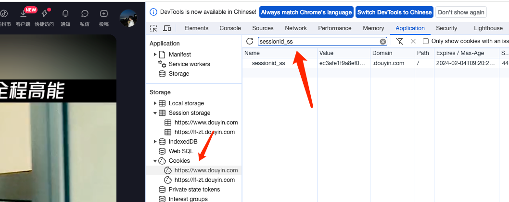

# goget
🚀「goget」是一个开箱即用的 [抖音](https://www.douyin.com) | [西瓜视频](https://www.ixigua.com) | [快手](https://www.kuaishou.com) | [Bilibili](https://www.bilibili.com) 视频解析工具


## ⚙ Installation

```text
go get -u github.com/eininst/goget
```

## ✨功能：
- 抖音视频/图片解析
- Bilibili视频解析
- 西瓜视频解析
- 快手视频解析

## Examples
```go
package main

import (
	"context"
	"github.com/eininst/flog"
	"github.com/eininst/goget"
)

func main() {
	ctx := context.TODO()

	//sessionidss值，从抖音PC网页版的cookie中获取(需登陆)，一般有效期在2-3个月
	douyinUrl := "0.00 yGI:/ 12/31 M@j.Pk 我在阴暗潮湿的角落里。# 无声卡清唱 # 深夜  https://v.douyin.com/iRTEcALS/ 复制此链接，打开Dou音搜索，直接观看视频！"
	dyRes, _ := goget.GetDouyinVideo(ctx, douyinUrl, "7e133c8db26fbb6ec369b5c551aa4d14")
	flog.Info(dyRes)

	ksUrl := "https://www.kuaishou.com/f/X-6zXwx2FWB392fT"
	ksRes, _ := goget.GetKsVideo(ctx, ksUrl)
	flog.Info(ksRes)

	xgUrl := "https://v.ixigua.com/i81d1TRv/"
	xgRes, _ := goget.GetXgVideo(ctx, xgUrl)
	flog.Info(xgRes)

	bilibiliUrl := "【跟我一起7k7k棒棒！！唱了蹦迪神曲派对咖孔明OP《チキチキバンバン》】 https://www.bilibili.com/video/BV1dG411i7c4/?share_source=copy_web&vd_source=f9a7d808022d5679dce148d57aab4a45"
	bres, _ := goget.GetBilibiliVideo(ctx, bilibiliUrl)
	flog.Info(bres)
}
```

## TODO
### 解析抖音视频，需要登陆用户的cookie

`登陆网页版抖音抖音后, 找到cookie中的 sessionid_ss参数， 复制该值, 有效期一般在2-3个月，建议使用小号的cookie`


